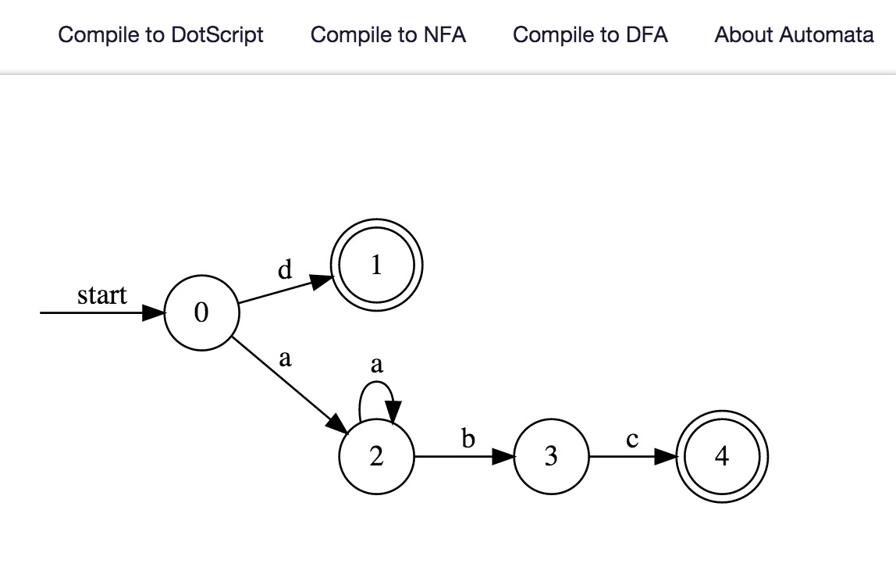

# Automata.js

Automata.js is a regular expression converter written in JS for both Node.js and browser.

It aims to convert regular expression to finite state machine(FSM, like NFA).
Besides, dot script transition is provided so that you can make diagrams with [Graphiz][1].

[Try it online](http://hokein.github.io/Automata.js/)!



## Development

```bash
// Install dependency modules.
npm install

// Run test.
make test

// Generate browser js.
make distribution
```

## API Description

Currently, Automata.js supports minimal regular expressions:

* `+`: One or more
* `*`: Zero or more
* `?`: Zero or one
* `()`: Capture everything enclosed
* `|`:  Or
* `\n`: Newline
* `\r`: Carriage return
* `\t`: Tab
* `\w`: [a-zA-Z0-9\_]
* `\d`: [0-9]

### FSM

`FSM` is a object represent a finite state machine(NFA, DFA).

The json definition is below:

```
{
  initialState: 'id',
  acceptState: ['id', ... ] ,
  numOfStates: Integer,
  type: 'DFA' or 'NFA',
  transitions: {
    'id': { 'to_id': label, },
    ...,
  }
}
```

#### FSM.toDotScript()

Convert the fsm to Graphiz dot script.

#### FSM.match(text)

* `text`: String

Determine whether `text` matches to the FSM. This methods only supports DFA.

### RegParser

RegParser is a regular expression parser.

#### RegParser.reset(string)

Set regular expression `string` in parser.

#### RegParser.parseToNFA()

Parses the given regular expression.

Returns a `FSM` object, the `FSM` represents a Nondeterministic Finite Automata(NFA).

#### RegParser.parseToDFA()

Parses the given regular expression.

Returns a `FSM` object, the `FSM` represents a Deterministic Finite Automata(DFA).

## Usage

### Usage in Node.js

Install via `npm install automata.js`.

```
var regParser = require('automata.js');

var parser = new regParser.RegParser('a*b');
var nfa = parser.parseToNFA();

console.log(nfa.toDotScript());
```

### Usage in Browser

Automata.js uses [node-browserify][2] to generate a browser distribution.

You can use [Viz.js][3] to render [graphiz dot script][4] in your web page.

```
var regParser = require('automata.js');

var parser = new regParser.RegParser('a*b');
var nfa = regParser.parseToNFA();

// render dot script to svg.
var result = Viz(nfa.toDotScript(), 'svg', 'dot');
```

[1]:http://www.graphviz.org/
[2]:https://github.com/substack/node-browserify
[3]:https://github.com/mdaines/viz.js/
[4]:http://www.graphviz.org/content/dot-language
